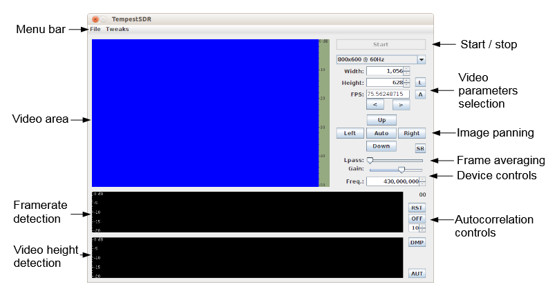

# TEMPEST Visual Eavesdropping with TempestSDR

## 1. Context

This guide explains how to perform a visual TEMPEST attack using TempestSDR with a Software Defined Radio (SDR) such as HackRF or USRP. The goal is to visualize what is displayed on a monitor by capturing electromagnetic emissions from video cables (VGA, DVI, HDMI, DisplayPort).

**For educational and research use only.**

### References

* [TempestSDR – Martin Marinov, 2014 (University of Cambridge)](https://github.com/martinmarinov/TempestSDR)
* [SSTIC 2018 – Ricordel & Duponchelle](https://www.sstic.org/media/SSTIC2018/SSTIC-actes/risques_spc_dvi_et_hdmi-duponchelle_ricordel/SSTIC2018-Article-risques_spc_dvi_et_hdmi-duponchelle_ricordel.pdf)
* [Deep-TEMPEST 2024](https://arxiv.org/abs/2407.09717)

---

## 2. Required Hardware

* **SDR**: HackRF One or USRP B205mini
* **Antenna**: Any high-gain antenna (e.g., Yagi type) operating in the 380–500 MHz range
* **Cable**: Target HDMI, DVI, VGA, or DisplayPort cable (preferably poorly shielded)
* **LNA (optional)**: Low-Noise Amplifier to improve reception

---

## 3. Quick Environment Setup

You can use the custom Git repository [tempest-installer](https://gitlab.laas.fr/sdajbog/tempest-installer) with a multiplatform Makefile for automated setup under Windows and Linux:

```bash
git clone https://gitlab.laas.fr/sdajbog/tempest-installer.git
cd tempest-installer
make
```

The Makefile will handle:

* Dependency installation
* Building or launching TempestSDR with correct paths
* Copying necessary DLLs (on Windows)

Ensure you have:

* Zadig installed (Windows, for HackRF)
* UHD driver installed (for USRP)

**Note for Linux users**: The automated setup is primarily tested on Ubuntu Desktop and Raspberry Pi OS. If you're using a different Linux distribution or architecture, you may encounter compilation issues due to missing dependencies or incompatible package versions. In such cases, manual installation of dependencies and building from source may be required.

**Note for Windows users**: If the automated Makefile installation hangs or stalls, press Enter in the terminal to continue. For more reliable installation, consider manual setup instead of relying on the Makefile automation.

### Manual Windows Installation (Recommended)

**⚠️ Important**: Manual installation is strongly recommended for Windows users as the automated Makefile often encounters issues with PATH configuration and driver setup.

You'll need to install the following components manually and follow the setup instructions carefully:

**Required Software:**
- [Git](https://git-scm.com/download/win) - Add to PATH during installation
- [CMake](https://cmake.org/download/) - Add to PATH during installation
- [Python 3](https://www.python.org/downloads/) - Add to PATH during installation
- [Visual C++ Redistributables 2008](https://www.microsoft.com/en-us/download/details.aspx?id=29) & [2015+](https://aka.ms/vs/17/release/vc_redist.x86.exe)
- [Java 8 JRE (32-bit)](https://adoptium.net/temurin/releases/?version=8&arch=x86&package=jre) - required for TempestSDR
- [Zadig](https://zadig.akeo.ie/) (for USB drivers)
- [Dependencies GUI](https://github.com/lucasg/Dependencies/releases) (for DLL troubleshooting)

**SDR Drivers & Tools:**
- [UHD 3.9.4](https://files.ettus.com/binaries/uhd_stable/uhd_003.009.004-release/uhd_003.009.004-release_Win32_VS2015.exe) (for USRP support)
- [HackRF drivers and tools](https://github.com/greatscottgadgets/hackrf/releases)

**Critical Setup Steps:**

1. **Java Configuration**: Create a PowerShell alias to avoid conflicts with existing Java installations:
   ```powershell
   # Add this to your PowerShell profile
   Set-Alias -Name java32 -Value "C:\Program Files (x86)\Eclipse Adoptium\jre-8.0.xxx-hotspot\bin\java.exe"
   ```

2. **Zadig Driver Setup**: 
   - Connect your HackRF/USRP
   - Launch Zadig
   - Select your device from the dropdown
   - Choose **WinUSB** as the driver
   - Click "Replace Driver"

3. **PATH Verification**: Ensure all tools are accessible by opening a new PowerShell window and testing:
   ```powershell
   git --version
   cmake --version
   python --version
   hackrf_info  # Should detect HackRF
   uhd_find_devices  # Should detect USRP
   ```

**TempestSDR Components:**
- Download precompiled [TempestSDR JAR](https://github.com/martinmarinov/TempestSDR/raw/master/Release/JavaGUI/JTempestSDR.jar)
- Native DLLs: [TSDRPlugin_RawFile.dll](https://github.com/martinmarinov/TempestSDR/raw/master/Release/dlls/WINDOWS/X86/TSDRPlugin_RawFile.dll), [TSDRPlugin_ExtIO.dll](https://github.com/martinmarinov/TempestSDR/raw/master/Release/dlls/WINDOWS/X86/TSDRPlugin_ExtIO.dll)
- ExtIO drivers: [ExtIO_HackRF.dll](https://github.com/jocover/ExtIO_HackRF/releases/download/v1.0/ExtIO_HackRF.dll), [ExtIO_USRP.dll](http://spench.net/drupal/files/ExtIO_USRP+FCD+RTL2832U+BorIP_Setup.zip)

**File Organization:**
Create a folder (e.g., `TempestSDR`) and place:
- `JTempestSDR.jar` and `TSDRPlugin_*.dll` files in the main folder
- ExtIO drivers (`ExtIO_*.dll`) in a subfolder called `extio`
- Use Dependencies GUI to verify all DLLs are properly linked

**Note**: After installation, restart PowerShell to refresh environment variables. If TempestSDR fails to load with DLL errors, use Dependencies GUI to verify plugins are 32-bit (should show "i386" in Machine field). Missing DLLs can be downloaded from https://fr.dll-files.com/ and placed in the same folder as the JAR or in `C:\Windows\SysWOW64`.

### Testing SDR Hardware Connection

After installation, verify your SDR is properly recognized:

**Check USB connection:**
```bash
# Linux
lsusb

# Windows (PowerShell)
Get-PnpDevice -Class USB
```

**Test HackRF:**
```bash
hackrf_info
```

**Test USRP:**
```bash
uhd_find_devices
# Download USRP firmware images (if needed)
uhd_images_downloader
```

### Launching TempestSDR

Once hardware is confirmed working, launch TempestSDR using the 32-bit Java runtime:

```bash
# Linux
java -jar /path/to/TempestSDR/JavaGUI/JTempestSDR.jar

# Windows (PowerShell)
java32 -jar JTempestSDR.jar
# Or direct path:
# & "C:\Program Files (x86)\Eclipse Adoptium\jre-8.0.xxx-hotspot\bin\java.exe" -jar JTempestSDR.jar
```

#### TempestSDR Interface Overview

<div align="center">

</div>

**Key Interface Elements:**
- **Frequency**: Set the target frequency found with CubicSDR/GQRX
- **Gain**: Adjust signal amplification (mid-range recommended)
- **Lpass**: Low-pass filter to reduce noise
- **Start/Stop**: Begin/end signal capture
- **Aut**: Auto-correlation for sync detection
- **Main Display**: Shows captured video signal
- **Autocorrelation Graph**: Helps with signal synchronization

Add screenshots here:

* `captures/windows_installation.jpg`
* `captures/linux_terminal_build.jpg`

---

## 4. Step-by-Step Usage Guide

### 4.1 Finding the Right Frequency

Use `CubicSDR` or `GQRX` to locate comb-shaped peaks on the spectrum, typical of video signal harmonics.

Example frequency catalog:

| Cable | Resolution | Framerate | Observed Frequency |
| ----- | ---------- | --------- | ------------------ |
| VGA   | 1920x1080  | ~60 Hz     | ~440–450 MHz        |
| DVI  | 1920x1080  | ~60 Hz     | ~445–450 MHz        |
| HDMI-USBC   | 1920x1080  | ~60 Hz     | ~455 MHz        |
| HDMI-USBC   | 640x480   | ~60 Hz     | ~400-405 MHz/~440-450 MHz           |
| HDMI-USBC   | 848x480   | ~60 Hz     | ~472 MHz        |
| HDMI-USBC   | 800x600   | ~56 Hz     | ~468 MHz        |
| HDMI-USBC   | 800x600   | ~60 Hz     | ~480-**498** MHz        |
| DisplayPort | 1920x1080  | ~60 Hz     | ~405 MHz        |
| DisplayPort | 1600x900   | ~60 Hz     | ~360/425 MHz        |
| DisplayPort | 1280x1024   | ~75 Hz     | ~335/420 MHz        |
| DisplayPort | 1152x864   | ~75 Hz     | ~335/420 MHz        |
| DisplayPort | 1152x864   | ~60 Hz     | ~405 MHz        |
| DisplayPort | 800x600   | ~75 Hz     | ~335/420 MHz        |
| DisplayPort | 800x600   | ~60 Hz     | ~335/410 MHz        |  

### 4.2 Configuring TempestSDR

#### For Linux Users:

**Option 1: USRP (Recommended - Native Support)**
1. Open TempestSDR
2. Go to `File > Load USRP (via UHD)` and enter:
   ```
   --args "type=b200" --rate 16000000 --ant RX2 --bw 16000000
   ```
   **Note**: On Raspberry Pi, use `--rate 8000000 --bw 8000000` for better performance
3. Press Enter and wait for USRP initialization
4. Set additional parameters:
   * **Gain**: mid-range
   * **Low-pass filter**: first third of slider
5. Tune to the frequency you observed with `CubicSDR`
6. Press **Start** and adjust settings until you see something recognizable

**Option 2: HackRF (File Recording Method)**
1. First, launch HackRF Transfer GUI to record the signal:
   ```bash
   python3 /path/to/TempestSDR/HackRF_Transfer-GUI/HackRF_Recorder.py
   ```
   Set parameters:
   * **Sample rate**: 16 Msps (or 8 Msps on Raspberry Pi for better performance)
   * **LNA Gain**: ~24
   * **VGA Gain**: ~32
   * **Amp**: Enabled
   * **Frequency**: Use the one found with CubicSDR
   * Start recording

2. In TempestSDR, go to `File > Load From file` and select the `.raw` file generated by HackRF_Recorder.py (located in the same directory as the script)
3. Set the frequency to match the one used in recording
4. Adjust settings as needed

#### For Windows Users:

**For both USRP and HackRF (ExtIO Method):**
1. Open TempestSDR
2. Go to `File > Load ExtIO source`
3. In the dialog that appears, select the appropriate DLL:
   * For HackRF: `ExtIO_HackRF.dll`
   * For USRP: `ExtIO_USRP.dll`
4. Set parameters:
   * **Sample rate**: 16 Msps (or 8 Msps for lower-end systems)
   * **Gain**: mid-range for USRP, LNA ~24 / VGA ~32 for HackRF
   * **Low-pass filter**: first third of slider
   * **Frequency**: Use the one found with CubicSDR
5. Press **Start** and adjust settings until you see something recognizable

Screenshot zones:

* `captures/tempestsdr_settings.jpg`
* `captures/signal_peaks_cubicsdr.jpg`

---

## 5. Manual Synchronization Tips

If no image appears:

* Try slightly adjusting the frequency (±0.5 MHz)
* Reduce low-pass filter bandwidth
* Check for activity on screen (checkerboard + terminal works best)
* Try getting closer to the cable (1–2 meters recommended with directional antenna)
* **Antenna positioning**: If using a directional antenna, aim towards the cable ends (computer or monitor side) for better signal reception
* **For well-shielded cables**: Get as close as possible, even touching the cable, especially with newer/better shielded cables

---

## 6. Example Results

### Best observed case:

* **Cable**: VGA
* **Antenna**: Yagi 433 MHz (or equivalent gain)
* **SDR**: HackRF or USRP
* **Distance**: 1–2 meters

Images:

* `captures/example_damier.jpg`
* `captures/example_terminal.jpg`

---

## 7. FAQ / Troubleshooting

| Problem               | Solution                                         |
| --------------------- | ------------------------------------------------ |
| No signal             | Use `CubicSDR` to locate frequency               |
| Image is black        | Reduce lowpass filter cutoff, check screen state |
| Raspberry Pi too slow | Lower sample rate to 8 Msps                      |
| Desync or flickering  | Adjust sync timing in TempestSDR manually        |
| Windows: PATH not updated after install | Restart PowerShell/Command Prompt to refresh environment variables |
| Windows: DLL loading errors | Use Dependencies GUI to verify plugins are 32-bit (should show "i386" in Machine field). If DLLs appear in red (missing), download from https://fr.dll-files.com/ and place in same folder as JAR or in SysWOW64 |

---

## 8. Additional Resources

* [TempestSDR GitHub](https://github.com/martinmarinov/TempestSDR)
* [CubicSDR](https://cubicsdr.com/)
* [HDMI 1.3a Specification](https://www.hdmi.org/spec)
* [Deep-TEMPEST dataset and code](https://github.com/emidan19/deep-tempest)
* [SSTIC 2018 Presentation](https://www.sstic.org/media/SSTIC2018/SSTIC-actes/risques_spc_dvi_et_hdmi-duponchelle_ricordel/SSTIC2018-Article-risques_spc_dvi_et_hdmi-duponchelle_ricordel.pdf)